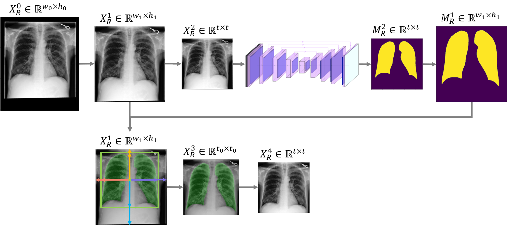

## GMIA-MIMIC-CXR-JPG Dataset Pre-processing &mdash; Official PyTorch implementation



[**Data Exfiltration and Anonymization of Medical Images based on Generative Models** (Chapter3-4, p57-59)](https://inria.hal.science/tel-04875160)<br>
Huiyu Li<br>

## Motivation
The original images from the source dataset (e.g. MIMIC-CXR-JPG dataset) vary in size, making them unsuitable for neural network training. To standardize the raw images and ensure compatibility, we developed a preprocessing pipeline that resizes all images to a uniform size.

## Requirements

* 64-bit Python 3.9 pytorch==1.13.0 torchvision==0.14.0 torchaudio==0.13.0 pytorch-cuda=11.7. See [https://pytorch.org/](https://pytorch.org/) for PyTorch install instructions.

## Getting started

**MIMIC-CXR-JPG**:
Step 0: Download the [MIMIC-CXR-JPG dataset](https://physionet.org/content/mimic-cxr-jpg/2.1.0/).

Step1: Boundary crop and insert the new image size (optinal)

```.bash
python crop_black_boundary.py
```

Step2: Resize the image to required input size of the U-net<br>
Step3: Get the segmentation masks<br>
Step4: Zoom in the segmentation masks<br>
Step5: Get a squared bbox <br>
    Get the center point C of the lung mask bbox<br>
    Get the shortest distance from C to boundaries<br>
Step6: Crop the image with the squared bbox<br>
Step7 Resize the image into a uniform size (e.g. 512*512)<br>

```.bash
python python3 pre_processing.py
```

References:
1. [Lung segmentation](https://github.com/IlliaOvcharenko/lung-segmentation)

## Citation
```
@article{li2025generative,
  title={Generative medical image anonymization based on latent code projection and optimization},
  author={Li, Huiyu and Ayache, Nicholas and Delingette, Herv{\'e}},
  booktitle={IEEE International Symposium on Biomedical Imaging (ISBI 2025)},
  year={2025}
}
@phdthesis{li2024data,
  title={Data exfiltration and anonymization of medical images based on generative models},
  author={Li, Huiyu},
  year={2024},
  school={Universit{\'e} C{\^o}te d'Azur}
}
```
